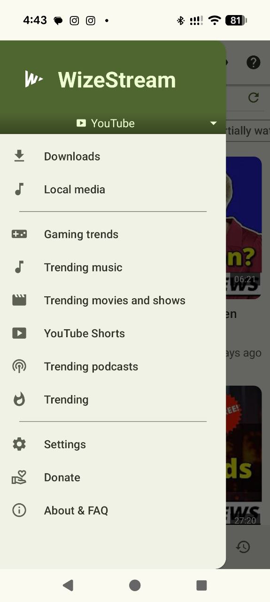
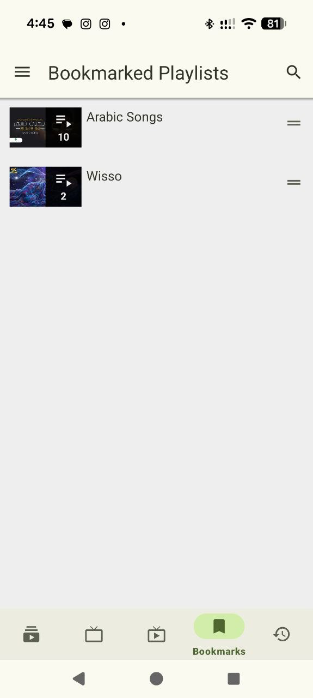

<p align="center"><a href="https://github.com/wizdom13/WizeStream"></a></p>

<h1 align="center">WizeStream</h1>

<p align="center"><b>A Material 3-focused streaming app based on NewPipe.</b></p>

<p align="center">
  <a href="https://apt.izzysoft.de/packages/org.wisso.newpipematerial"></a>
  <a href="https://github.com/wizdom13/WizeStream/releases"></a>
  <br>
  <a href="https://github-store.org/app?repo=wizdom13/WizeStream"></a>
</p>

<p align="center">
  <a href="https://www.gnu.org/licenses/gpl-3.0"></a>
  <a href="https://github.com/wizdom13/WizeStream/actions"></a>
  <a href="https://apt.izzysoft.de/packages/org.wisso.newpipematerial"></a>
  <a href="https://shields.rbtlog.dev/org.wisso.newpipematerial"></a>
</p>

<p align="center">
  <a href="#important-project-notice">Project notice</a> •
  <a href="#what-is-wizestream">About</a> •
  <a href="#screenshots">Screenshots</a> •
  <a href="#supported-services">Services</a> •
  <a href="#features">Features</a> •
  <a href="#installation">Installation</a> •
  <a href="#building-from-source">Build</a> •
  <a href="#release-signing">Signing</a> •
  <a href="#development-status">Development</a> •
  <a href="#contributing">Contributing</a> •
  <a href="#upstream-newpipe">Upstream</a> •
  <a href="#donate">Donate</a> •
  <a href="#license">License</a>
</p>

<p align="center">Translations are welcome, but only native-speaker reviewed translations will be added.</p>

---

## Important project notice

WizeStream is an independently maintained Android streaming app based on NewPipe, focused on Material 3 design, app theming, playback enhancements, and product polish.

It is **not affiliated with, sponsored by, or endorsed by** the official NewPipe project, TeamNewPipe, or NewPipe e.V.

WizeStream preserves the NewPipe libre software license, upstream credits, and third-party license notices.

- [Frequently asked questions](docs/faq.md)
- [Privacy policy](PRIVACY.md)

### Rebranding from NewPipe Material

This project was previously distributed as **NewPipe Material**. In July 2026, NewPipe e.V. asked the project to adopt a unique name that does not use the registered NewPipe word mark, in accordance with its trademark policy. The project was therefore renamed to **WizeStream**.

The rebranding changes the public app name, visual identity, repository name, and distribution metadata. It does **not** change the app's technical identity or update path: existing installations continue to use the same application ID, and can receive normal updates signed with the same release key. User data and settings are not reset by the name change.

WizeStream remains based on NewPipe and continues to preserve upstream attribution, licensing, and third-party notices. The rename is intended to clearly distinguish this independently maintained project from official NewPipe while respecting the upstream project's trademark policy. See [issue #34](https://github.com/wizdom13/WizeStream/issues/34) for the original request.

### Independent versioning

WizeStream has its own release cycle and follows semantic versioning:

- `MAJOR.MINOR.PATCH`, such as `1.0.0`, `1.1.0`, and `1.1.1`
- Git tags use the corresponding `vMAJOR.MINOR.PATCH` form
- WizeStream version numbers do not contain or follow NewPipe version numbers

NewPipe remains an upstream source and is credited as required, but its version is development
metadata rather than part of WizeStream's public version identity. The currently tracked upstream
baseline is recorded in [UPSTREAM.md](UPSTREAM.md).

---

## What is WizeStream?

WizeStream keeps the lightweight, privacy-friendly NewPipe experience while modernizing the interface and adding playback-focused features.

Project highlights:

- Material 3-inspired app surfaces, dialogs, settings, tabs, and navigation
- Dynamic Material You color support where available
- Manual theme color presets
- Bottom navigation with a configurable default main tab
- SponsorBlock integration
- YouTube dislike count support
- Swipe seek, fullscreen swipe, and hold-to-speed-up player gestures
- Swipe down from the video player to return to the miniplayer
- Optional keep-video-visible mode while scrolling the details page
- Import/export compatibility with supported NewPipe backup data

Sensitive areas such as playback, downloads, background playback, popup playback, and extractor logic are changed only through focused and tested work.

---

## Screenshots

### Phone

<p align="center">
  <a href="fastlane/metadata/android/en-US/images/phoneScreenshots/01.png"></a>
  <a href="fastlane/metadata/android/en-US/images/phoneScreenshots/02.png"></a>
  <a href="fastlane/metadata/android/en-US/images/phoneScreenshots/03.png"></a>
  <a href="fastlane/metadata/android/en-US/images/phoneScreenshots/04.png"></a>
  <a href="fastlane/metadata/android/en-US/images/phoneScreenshots/05.png"></a>
  <a href="fastlane/metadata/android/en-US/images/phoneScreenshots/06.png"></a>
  <a href="fastlane/metadata/android/en-US/images/phoneScreenshots/07.png"></a>
  <a href="fastlane/metadata/android/en-US/images/phoneScreenshots/08.png"></a>
  <a href="fastlane/metadata/android/en-US/images/phoneScreenshots/09.png"></a>
  <a href="fastlane/metadata/android/en-US/images/phoneScreenshots/10.png"></a>
  <a href="fastlane/metadata/android/en-US/images/phoneScreenshots/11.png"></a>
  <a href="fastlane/metadata/android/en-US/images/phoneScreenshots/12.png"></a>
</p>

### Tablet

<p align="center">
  <a href="fastlane/metadata/android/en-US/images/tenInchScreenshots/09.png"></a>
  <a href="fastlane/metadata/android/en-US/images/tenInchScreenshots/10.png"></a>
</p>

---

## Supported services

WizeStream inherits support for these services from the NewPipe and NewPipe Extractor codebase:

- YouTube and YouTube Music
- PeerTube
- Bandcamp
- SoundCloud
- media.ccc.de

Service support depends on the pinned upstream-derived extractor code.

---

## Features

Core features include:

- Watch videos and live streams
- Background playback
- Popup player
- Local playlists
- Subscriptions without signing in to a platform account
- Channel groups and feeds
- Search and browse supported services
- View video details, related videos, and comments where supported
- Download video, audio, and captions where supported
- Import and export app data for migration and backup

WizeStream additions include:

- Material 3 theme roles across more app surfaces
- Bottom navigation for five or fewer main tabs, with a scrollable tab layout for larger tab sets
- Configurable default main tab
- Dynamic and manual theme color support
- SponsorBlock and dislike-count support
- Enhanced player gestures
- Optional pinned video while scrolling
- Independent release signing

---

## Installation

### IzzyOnDroid

<a href="https://apt.izzysoft.de/packages/org.wisso.newpipematerial"></a>

Install WizeStream through an F-Droid-compatible client from the IzzyOnDroid repository.

### Release APK

<a href="https://github.com/wizdom13/WizeStream/releases"></a>

Install WizeStream from this repository's GitHub releases or signed build artifacts when available.

Releases: https://github.com/wizdom13/WizeStream/releases

WizeStream uses a different application ID from official NewPipe, so both apps can be installed side by side:

```text
WizeStream:        org.wisso.newpipematerial
Debug build:       org.wisso.newpipematerial.debug
```

### GitHub Store

<a href="https://github-store.org/app?repo=wizdom13/WizeStream"></a>

Install WizeStream through GitHub Store.

### Migrating data

WizeStream does not automatically share app data with official NewPipe.

To migrate:

1. Open official NewPipe.
2. Export your database from Settings > Backup and Restore.
3. Install WizeStream.
4. Import the exported database from Settings > Backup and Restore.

Always keep a backup before importing data between builds.

### Nightly builds

Automated nightly builds of the latest `pipe` commit are available here:

https://github.com/wizdom13/WizeStream_Nightly/releases

Nightly builds are unstable testing versions and use the separate application ID
`org.wisso.newpipematerial.nightly`, so they can be installed alongside the stable app.

See [Nightly build documentation](docs/nightly-builds.md) for details.

### Google Play warning

Do not publish WizeStream or forks of NewPipe to Google Play without first reviewing all applicable upstream, platform, and trademark requirements.

---

## Building from source

WizeStream uses a pinned `PipePipeExtractor` Git submodule. Clone the repository together with its pinned submodule:

```bash
git clone --recurse-submodules https://github.com/wizdom13/WizeStream.git
cd WizeStream
```

For an existing checkout or after switching commits or tags:

```bash
git submodule sync --recursive
git submodule update --init --recursive
```

Requirements:

- Git with submodule support
- JDK 21
- Android SDK with the required platform and build tools
- Accepted Android SDK licenses

Build the debug APK and run JVM checks:

```bash
scripts/build.sh debug
```

Other build modes:

```bash
scripts/build.sh release
scripts/build.sh connected
scripts/build.sh checkstyle
```

Do not use `git submodule update --remote` for release builds. Every release must use the extractor commit recorded by the app commit or tag.

See [BUILDING.md](BUILDING.md) for complete build, signing, submodule, and reproducible-release instructions.

The debug APK uses the app label **WizeStream Debug** and package `org.wisso.newpipematerial.debug`.

---

## Release signing

Configure release signing with the WizeStream environment-variable names:

```text
WIZESTREAM_RELEASE_STORE_FILE
WIZESTREAM_RELEASE_STORE_PASSWORD
WIZESTREAM_RELEASE_KEY_ALIAS
WIZESTREAM_RELEASE_KEY_PASSWORD
```

The legacy `NEWPIPE_MATERIAL_RELEASE_*` names remain accepted as fallbacks for existing environments.

When all four values are present, build the signed release APK with:

```bash
scripts/build.sh release
```

The release APK is generated under `app/build/outputs/apk/release/`. Verify it with:

```bash
apksigner verify --verbose --print-certs app/build/outputs/apk/release/app-release.apk
```

A published APK must be built from the exact commit referenced by its release tag, including the pinned extractor submodule commit.

---

## Development status

WizeStream is under active development for Material 3 polish, playback improvements, and release readiness.

Completed or in-progress areas include:

- Public WizeStream identity
- Debug and release identity separation
- Material 3 theme colors
- Dynamic and manual theme color handling
- Bottom navigation and main-tab polish
- About-screen attribution
- Player gestures and pinned-video behavior
- Dialog, snackbar, settings, video-detail, and download UI polish
- Release-signing workflow support

High-risk areas receive dedicated QA before broad behavior changes.

---

## Contributing

Contributions are welcome, especially focused Material 3 polish, bug fixes, QA findings, documentation, and release-readiness work.

Please keep changes focused and testable. For UI work, include before-and-after screenshots where possible and verify Light, Dark, Black, Follow system, and at least one manual theme color preset.

### PipePipeExtractor submodule

WizeStream builds against the `wizdom13/PipePipeExtractor` fork through the pinned submodule at `external/NewPipeExtractor`.

```bash
git submodule sync --recursive
git submodule update --init --recursive
```

The recorded submodule commit is part of the source definition. Do not replace it with the latest branch tip when preparing a release or reproducible build.

---

## Upstream NewPipe

WizeStream is based on NewPipe.

WizeStream does not mirror NewPipe's release numbers. See [UPSTREAM.md](UPSTREAM.md) for the
upstream baseline currently tracked by this repository.

Upstream resources:

- NewPipe repository: https://github.com/TeamNewPipe/NewPipe
- NewPipe website: https://newpipe.net
- NewPipe FAQ: https://newpipe.net/FAQ/
- NewPipe Extractor: https://github.com/TeamNewPipe/NewPipeExtractor

Please report issues carefully:

- WizeStream-specific design, identity, release, and feature issues belong in this repository.
- Upstream extractor or service breakages may also need to be checked against official NewPipe.

---

## Donate

To support upstream NewPipe, see its official donation page:

https://newpipe.net/donate

Upstream donations go to the upstream NewPipe project, not automatically to WizeStream.

---

## License

WizeStream is free software based on NewPipe and is distributed under the GNU General Public License version 3 or later.

See the repository license files and in-app license screen for full license and third-party notice details.
